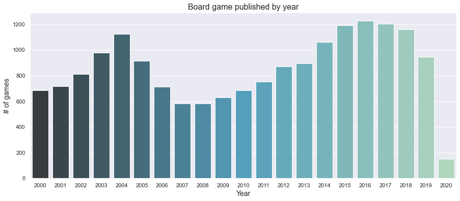

# Board Games Ratings
**Identifying the features that contributes to the ratings of a board games and using those feature training ML model.**
 Janki Chauhan
 
[Linkedin](https://www.linkedin.com/in/jankichauhan/) | [Github](https://github.com/jankichauhan) | [Board Game Geek](https://boardgamegeek.com/user/jankichauhan)

## Contents

* [Motivation](#motivation)
* [Data Exploration](#data-exploration)
  * [Pipeline](#pipeline-source)
  * [Analysis](#analysis)
* [Modeling](#modeling)
  * [Base Model](#basemodel)
  * [Tunning](#tunning)
* [Conclusion](#conclusion)
* [Future Analysis](#future-analysis)

## Motivation

## Data Exploration
I am using board game geek's api to get information on individual board game.
### Pipeline

[BGG API](https://boardgamegeek.com/wiki/page/BGG_XML_API)

### Analysis
Each board game has data following(and more) fields that I will be working with.  
  > -`board_game_id` 
  > -`name` 
  > -`yearpublished` 
  > -`minplayer` 
  > -`maxplayer`
  > -`playingtime`
  > -`averagerating`
  > -`boardgamedesigner`
  > -`boardgamecategory`
  > -`boardgamemechanic`
  > -`boardgamepublisher`
  > -`age`
  > -`rank`
 
 #### Number of board games published in last 20 years
 
 
 
 #### Published board games by categories
 
 
 
 #### Game designer in top 100 games(rank by BGG)
 
 
 
