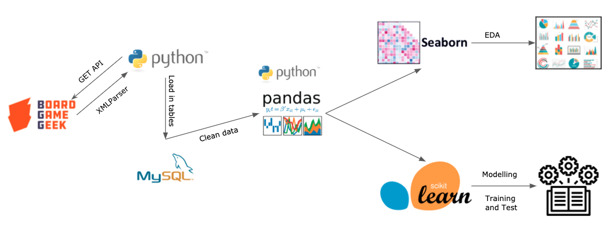

# Bad, Medicore, Good or Outstanding?
**Identifying feature and predicting board game ratings.**
 Janki Chauhan
 
[Linkedin](https://www.linkedin.com/in/jankichauhan/) | [Github](https://github.com/jankichauhan) | [Board Game Geek](https://boardgamegeek.com/user/jankichauhan)

## Contents

* [Motivation](#motivation)
* [Data Exploration](#data-exploration)
  * [Data Pipeline](#pipeline-source)
  * [Analysis](#analysis)
* [Modeling](#modeling)
  * [Base Model](#basemodel)
  * [Tunning](#tunning)
* [Conclusion](#conclusion)
* [Future Analysis](#future-analysis)

## Motivation
I got introduced to board games in Dec 2010, no one had plans for the holidays and we all had enough of movie watching. We played Ticket to Ride and then Settler of Catan a few days later; it was so much fun, I loved it. Since then it has been board games over movies(for me!)
When you have been board games for 10 years, you start developing your favorites. I am biased towards Euro games(specially worker placement games), any game by Jamey Stegmaier or Uwe Rosenberg I am willing to give a try. On the other hand card games are not in my top 10. Dominion is one of the best gateway games but it didn't appeal to me. The other criteria I heard a lot in the board game community is the playtime, some prefer longer and many prefer shorter playtime(so one can play again).
I believe these criterias play a significant part in rating a board game. My job here is to find such criterias i.e playtime, category, game designer and game publisher and weigh their significance. Are there other factors which influence the ratings of a game?

## Data Exploration
I am using board game geek's api to get information on individual board game, extract the fields using an xml parser and save it a sql table. 
### Data Pipeline

[BGG API](https://boardgamegeek.com/wiki/page/BGG_XML_API)

### Analysis
Each board game has data following(and more) fields that I will be working with.  
  > -`board_game_id` 
  > -`name` 
  > -`yearpublished` 
  > -`minplayer` 
  > -`maxplayer`
  > -`playingtime`
  > -`averagerating`
  > -`boardgamedesigner`
  > -`boardgamecategory`
  > -`boardgamemechanic`
  > -`boardgamepublisher`
  > -`age`
  > -`rank`
 
 #### Number of board games published in last 20 years
 
 
 
 #### Published board games by categories
 
 
 
 #### Game designer in top 100 games(rank by BGG)
 
 
 
 ## Modelling
 
 ### Base Model
 
 ### Tunning
 
 ## Conclusion
 
 
 
 ## Future Analysis
There is an increase in higher ratings over the years. Is it because the production quality has gotten better?

Using the same feature set can we predict if the game will be popular? 

How does kickstarter factors in game ratings, it definitely creates awareness before the game goes to production.

