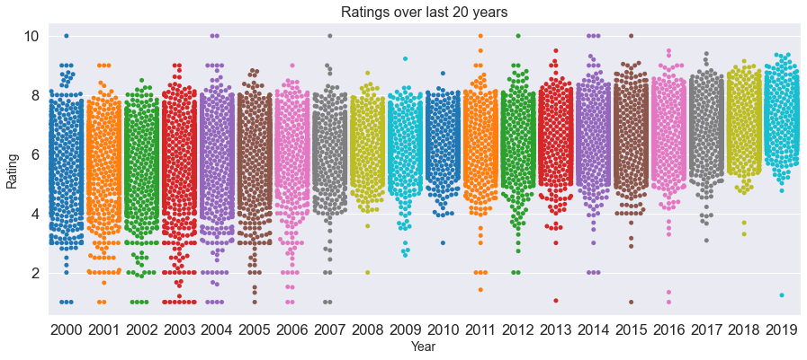

# Bad, Medicore, Good or Outstanding?
**Identifying the features that contributes to the ratings of a board games and using those feature training ML model.**
 Janki Chauhan
 
[Linkedin](https://www.linkedin.com/in/jankichauhan/) | [Github](https://github.com/jankichauhan) | [Board Game Geek](https://boardgamegeek.com/user/jankichauhan)

## Contents

* [Motivation](#motivation)
* [Data Exploration](#data-exploration)
  * [Pipeline](#pipeline-source)
  * [Analysis](#analysis)
* [Modeling](#modeling)
  * [Base Model](#basemodel)
  * [Tunning](#tunning)
* [Conclusion](#conclusion)
* [Future Analysis](#future-analysis)

## Motivation
The other day one of my classmate asked me 'which is my favorite board game? Do I have any recommendations?'. I immediately thought of Viticulture(you make wine and get points when you ship them). Overall I am really like playing games published by Stonemaier games. Jamey Stegmaier and Uwe Rosenberg are my top game designers. To answer the recommendation question, I always go with gateway games i.e. ones with straight forward rules, shorter playtime(so you can play again) and good components. Also, for me game designers and game publishers put good weight when trying new games. It will be interesting to see if these factors i.e playtime, complexity, game designer and game publisher contribute to the ratings of the game. Are there other factors which influence the ratings of game. 

## Data Exploration
I am using board game geek's api to get information on individual board game.
### Pipeline

[BGG API](https://boardgamegeek.com/wiki/page/BGG_XML_API)

### Analysis
Each board game has data following(and more) fields that I will be working with.  
  > -`board_game_id` 
  > -`name` 
  > -`yearpublished` 
  > -`minplayer` 
  > -`maxplayer`
  > -`playingtime`
  > -`averagerating`
  > -`boardgamedesigner`
  > -`boardgamecategory`
  > -`boardgamemechanic`
  > -`boardgamepublisher`
  > -`age`
  > -`rank`
 
 #### Number of board games published in last 20 years
 
 
 
 #### Published board games by categories
 
 
 
 #### Game designer in top 100 games(rank by BGG)
 
 
 
 ## Modelling
 
 ### Base Model
 
 ### Tunning
 
 ## Conclusion
 
 
 
 ## Future Analysis
There is an increase in higher ratings over the years. Is it because the production quality has gotten better?

Using the same feature set can we predict if the game will be popular? 

How does kickstarter factors in game ratings, it definitely creates awareness before the game goes to production.

